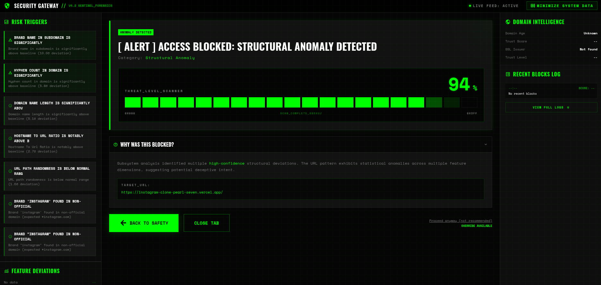
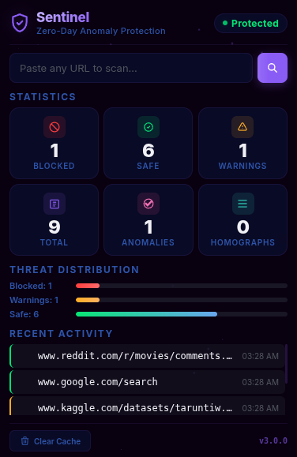

<p align="center">
  
</p>

**Browser-based malicious URL detection using dual ML engines, anomaly scoring, and homograph analysis — fully local, fully private.**

---

## Introduction

Phishing and malware delivery through URLs remains one of the most common attack vectors on the internet. Most detection tools either rely on static blocklists (which lag behind new threats) or send every URL you visit to a cloud API (which leaks your browsing history).

Sentinel takes a different approach. It runs two independent detection engines — a supervised XGBoost classifier trained on 137K labeled URLs, and an unsupervised Isolation Forest that learns what "normal" browsing looks like and flags structural deviations. Both run locally. No URL ever leaves your machine.

The result is a system that catches both known phishing patterns and zero-day threats that haven't appeared in any dataset yet.

---

## Demo


| Warning Page (Block) | Warning Page (Anomaly) | Extension Popup |
|---|---|---|
|  |  |  |

---

## Key Features

- **Dual-engine detection**: XGBoost classifier (pattern matching) + Isolation Forest (structural anomaly detection). They are complementary — ML catches labeled phishing, anomaly catches zero-day threats.
- **Homograph attack detection**: Identifies Cyrillic/Greek lookalike characters, punycode domains, and brand impersonation (e.g., `paypa1-secure.evil.com`).
- **Explainable risk scores**: Instead of a binary "safe/malicious", the system returns a 0-100 risk score with z-score deviation reports showing exactly which features triggered the alert.
- **Privacy-first architecture**: All processing happens locally. URLs are discarded after feature extraction. No browsing history stored. No external API calls.
- **User override for anomalies**: Anomalies show a warning page with "Proceed Anyway" — the system informs rather than dictates.
- **Real-time interception**: The browser extension intercepts navigation requests before the page loads, not after.
- **Domain reputation scoring**: WHOIS age, SSL certificate validation, DNS record checks, registrar analysis.
- **Intelligent caching**: Results cached for 1 hour per URL to avoid redundant processing.

---

## Architecture

```
Browser Extension (Chrome Manifest V3)
├── Whitelist check ─── known safe domains bypass all checks
├── Cache check ─────── 1-hour TTL avoids re-processing
├── Homograph check ─── client-side, instant (mixed scripts, punycode, brand spoofing)
├── @ symbol check ──── redirect attack detection
├── Anomaly engine ──── Isolation Forest via local backend API
│   └── Trained only on legitimate URLs
│   └── Flags structural deviations from baseline
│   └── Returns risk score + feature deviations
├── ML classifier ───── XGBoost via local backend API
│   └── Trained on 137K labeled URLs (50/50 split)
│   └── 50 engineered features per URL
│   └── Combined with reputation validation
└── Decision
    ├── MALICIOUS → block page (hard block)
    ├── HIGH_ANOMALY → warning page (user can proceed)
    ├── SUSPICIOUS → notification (no block)
    └── SAFE → pass through
```

The anomaly engine and ML classifier run independently and do not veto each other. A phishing site that looks structurally normal (e.g., `http://lcloudinc.com/DnCqA/`) will pass the anomaly engine but get caught by the ML classifier. A brand-new domain with unusual structure will pass the ML classifier but get caught by the anomaly engine.

---

## Tech Stack

| Layer | Technology |
|-------|-----------|
| Browser Extension | Chrome Manifest V3, JavaScript (ES6+), Chrome Storage API, WebRequest API |
| Backend API | Python 3.10+, FastAPI, Uvicorn |
| ML Classification | XGBoost, scikit-learn, pandas, numpy |
| Anomaly Detection | Isolation Forest (scikit-learn), StandardScaler |
| Feature Extraction | Custom 28-feature extractor (entropy, structural, deception indicators) |
| Domain Reputation | python-whois, dnspython, ssl (stdlib) |
| Serialization | joblib |

---

## How It Works

**Training phase (offline):**

1. Legitimate URLs are loaded from the training dataset (~68K domains).
2. Bare domains are augmented with realistic paths and query parameters (120+ templates) to prevent the model from learning that "having a path = suspicious".
3. 28 structural features are extracted per URL (entropy, character ratios, path depth, subdomain count, etc.).
4. An Isolation Forest model is trained only on these benign samples. It learns the statistical distribution of normal browsing.
5. Baseline statistics (mean, std, percentiles) are saved for each feature to enable explainable z-score deviations.

**Detection phase (real-time):**

1. User navigates to a URL. The extension intercepts the request before the page loads.
2. If the domain is whitelisted or cached, return immediately.
3. Run client-side homograph checks (mixed Unicode scripts, punycode, brand impersonation).
4. Check for `@` symbol redirect attacks.
5. Send URL to local backend `/api/anomaly` — the Isolation Forest scores structural deviation.
6. Send URL to local backend `/api/check` — the XGBoost classifier predicts malicious probability.
7. Combine results and make a decision: block, warn, notify, or allow.

---

## Installation and Setup

### Prerequisites

- Python 3.10+
- Chrome or Chromium browser
- ~500MB disk space (for models and datasets)

### 1. Clone the repository

```bash
git clone https://github.com/Nirupam-Ghosh2004/Sentinel.git
cd Sentinel
```

### 2. Set up the backend

```bash
cd backend
python3 -m venv venv
source venv/bin/activate
pip install -r requirements.txt
```

### 3. Train the anomaly model (if not already trained)

```bash
cd ../ml-models/src
../../backend/venv/bin/python train_anomaly_model.py
```

This will generate model files in `backend/app/ml_models/`.

### 4. Start the backend server

```bash
cd ../../backend
./venv/bin/python -m uvicorn app.main:app --reload --port 8000
```

Verify it's running: `http://localhost:8000/docs`

### 5. Install the browser extension

1. Open Chrome and navigate to `chrome://extensions/`
2. Enable "Developer mode" (top right)
3. Click "Load unpacked"
4. Select the `browser-extension/` folder

The extension icon should appear in your toolbar. Browse normally — it works automatically.

---

## Folder Structure

```
Sentinel/
├── backend/                        # FastAPI backend (all processing local)
│   ├── app/
│   │   ├── main.py                 # Application entry point
│   │   ├── config.py               # Configuration and thresholds
│   │   ├── routes/
│   │   │   ├── check.py            # /api/check (ML classification)
│   │   │   └── anomaly.py          # /api/anomaly (anomaly detection)
│   │   ├── services/
│   │   │   ├── anomaly_detector.py         # Isolation Forest scoring
│   │   │   ├── privacy_feature_extractor.py # 28-feature URL extractor
│   │   │   ├── homograph_detector.py       # Homograph attack detection
│   │   │   ├── risk_scorer.py              # Combined risk scoring
│   │   │   ├── ml_service_final.py         # XGBoost prediction
│   │   │   └── reputation/                 # WHOIS, DNS, SSL checks
│   │   ├── models/
│   │   │   └── schemas.py          # Pydantic request/response models
│   │   └── ml_models/              # Serialized model files (.pkl)
│   └── requirements.txt
├── browser-extension/              # Chrome Manifest V3 extension
│   ├── manifest.json
│   ├── background/
│   │   ├── background.js           # Main detection pipeline
│   │   ├── anomaly_engine.js       # Anomaly API client
│   │   └── homograph_checker.js    # Client-side homograph detection
│   ├── popup/                      # Extension popup UI
│   ├── warning.html                # Block/anomaly warning page
│   └── warning.js
├── ml-models/                      # Training pipeline
│   ├── src/
│   │   ├── train_anomaly_model.py  # Isolation Forest training
│   │   └── train_xgboost_v2.py     # XGBoost training
│   └── trained_models/
├── datasets/                       # Training data
│   ├── raw/                        # Downloaded from PhishTank, OpenPhish, etc.
│   ├── processed/                  # Merged train/validation/test splits
│   └── scripts/                    # Dataset download and merge scripts
└── README.md
```

---

<!-- ## Design Decisions

**Why two separate models instead of one?**

A supervised classifier (XGBoost) is great at catching URLs that look like things it has seen before. But it will miss a completely new phishing technique that doesn't match any training pattern. The Isolation Forest doesn't know what "malicious" looks like — it only knows what "normal" looks like. Anything structurally unusual gets flagged, even if it's never appeared in any dataset. The two models cover each other's blind spots.

**Why augment training data with paths?**

The legitimate URL dataset consists mostly of bare domains (`https://google.com`). Without augmentation, the Isolation Forest learns that "any URL with a path is abnormal", which causes false positives on sites like `reddit.com/r/programming/comments/...`. We augment with 120+ realistic path/query templates so the model treats path depth, query parameters, and URL length as normal.

**Why local-only processing?**

External API calls (VirusTotal, Google Safe Browsing) leak your browsing history to third parties. For a browser extension that monitors every navigation, this is a serious privacy concern. Everything in Sentinel runs on `localhost:8000`.

**Why Manifest V3?**

Chrome is deprecating Manifest V2. This extension uses service workers and the `chrome.webRequest` API to be forward-compatible.

**Why not hard-block anomalies?**

The anomaly engine catches structurally unusual URLs, but "unusual" doesn't always mean "dangerous". A legitimate but uncommon site will trigger it. Hard-blocking would frustrate users. Instead, anomalies show a warning page with a "Proceed Anyway" button — the user makes the final call. -->

---

## Performance

### Anomaly Detection Engine (Isolation Forest)

The anomaly engine is the core differentiator of this project. Unlike supervised classifiers that can only recognize patterns they were trained on, the Isolation Forest learns the statistical distribution of normal browsing and flags anything that deviates from it — including zero-day threats that have never appeared in any dataset.

**How it works**: Trained exclusively on ~274K augmented legitimate URLs. It extracts 28 structural features per URL (entropy, path depth, character ratios, subdomain count, etc.) and scores how far each feature deviates from the learned baseline. The output is a 0-100 risk score with per-feature z-score explanations.

**Evaluation on held-out test set (500 legitimate, 500 malicious):**

| | Legitimate URLs | Malicious URLs |
|---|---|---|
| Mean risk score | 20.1 / 100 | 60.8 / 100 |
| Classified NORMAL (< 50) | 97.4% | 22.8% |
| Classified SUSPICIOUS (50-69) | 2.4% | 41.6% |
| Classified HIGH_ANOMALY (70+) | 0.2% | 35.6% |

| Detection threshold | True positive rate | False positive rate |
|---|---|---|
| Risk >= 50 (SUSPICIOUS or above) | 77.2% | 2.6% |
| Risk >= 70 (HIGH_ANOMALY only) | 35.6% | 0.2% |

The engine intentionally doesn't try to catch everything. At the SUSPICIOUS threshold, it flags 77% of malicious URLs while only bothering users with 2.6% false positives. The remaining malicious URLs that look structurally normal are caught by the XGBoost classifier, which is trained on labeled phishing patterns. The two engines are complementary — the anomaly engine catches structural threats, the ML classifier catches pattern-based phishing.

| Metric | Value |
|--------|-------|
| Model | Isolation Forest (200 trees) |
| Training data | ~274K augmented benign URLs |
| Features per URL | 28 |
| Feature extraction time | < 5ms per URL |
| End-to-end latency | ~50-150ms (localhost round-trip) |
| Score separation (legit vs malicious) | 0.138 |

**Explainability**: When a URL is flagged, the system reports which specific features deviated and by how much. For example: "Domain name randomness is 4.2 standard deviations above the baseline" or "URL contains an IP address as hostname". This is done by comparing the URL's feature values against the per-feature mean and standard deviation from the training set.

### XGBoost Classifier (supervised, secondary)

| Metric | Value |
|--------|-------|
| Accuracy | 99.89% |
| Precision | 99.98% |
| Recall | 99.81% |
| False positive rate | 0.02% (2 in 10,296) |
| Training dataset | 137,268 labeled URLs (50/50 split) |
| Features per URL | 50 |

**A note on these numbers**: The test accuracy is high because the dataset is relatively easy to classify. Most legitimate URLs are bare domains (`socialdeal.nl`, `labnol.org`), while most malicious URLs have obvious structural tells (IP addresses, random subdomains, free hosting platforms). The XGBoost classifier alone would struggle against phishing sites that use clean-looking domains. This is exactly what the anomaly engine compensates for.

---

## Security Considerations

- No URL is ever stored after feature extraction. The raw string is used only within the `extract()` method scope.
- No external network calls. All API traffic stays on `127.0.0.1:8000`.
- The extension does not request permissions beyond `webRequest` and `storage`.
- Cache entries store only the classification result, not the URL features.
- `chrome.storage.local.clear()` wipes URL cache without affecting extension state.
- The `@` symbol check is the only hard-blocking heuristic. All other structural checks go through the anomaly engine with user override.

---

## Challenges Faced

**False positives on complex legitimate URLs**

The Isolation Forest initially flagged `amazon.com/dp/B09V3KXJPB` and `reddit.com/r/programming/comments/abc123/post` as high anomalies because the training data only contained bare domains. Solved by augmenting the training data with 120+ realistic path and query templates.

**Aggressive normalization curve**

The raw Isolation Forest score is a float around -0.40 to -0.65. Mapping this to a 0-100 risk scale required careful calibration. Too tight a range and legitimate complex URLs score 65+ (flagged). Too wide and actual threats score below 50 (missed). The current mapping uses [-0.38, -0.72] as the normalization range, calibrated against real URL score distributions.

**ML overriding anomaly engine**

Initially, when the ML classifier said "malicious" but the anomaly engine said "normal", the system deferred to anomaly. This caused false negatives — phishing sites like `http://lcloudinc.com/DnCqA/` look structurally normal but are pattern-based phishing. Fixed by making ML and anomaly complementary: neither vetoes the other.

**Bare-domain bias in standard deviation**

Features like `path_depth` had near-zero standard deviation in the original training data (because all URLs were bare domains). This caused any URL with a path to show a z-score of thousands. Fixed by introducing minimum standard deviation floors per feature type.

---

<!-- ## Roadmap

- [ ] Firefox extension support (WebExtensions API)
- [ ] URL screenshot preview on warning page (headless Chrome capture)
- [ ] Redirect chain analysis (detect multi-hop phishing)
- [ ] Typosquatting detection via Levenshtein distance
- [ ] User feedback loop ("Report false positive" button)
- [ ] Right-click context menu ("Scan this link with Sentinel")
- [ ] QR code URL scanner (decode and scan embedded URLs)
- [ ] Chrome Web Store publication
- [ ] Docker Compose for one-command deployment
- [ ] Weekly security digest (summary of blocked/flagged URLs) -->

---

## Use Cases

- **Daily browsing protection**: Runs silently in the background. Most users will only notice it when it blocks something.
- **Email link verification**: Paste a suspicious link from an email into the extension popup scanner before clicking it.
- **Security research**: The backend API can be used standalone to batch-scan URL lists via `curl` or Python scripts.
- **Enterprise deployment**: The local-only architecture means no data leaves the corporate network. No cloud dependency.
- **Education**: The explainable risk scores (z-score deviations, feature breakdowns) make it useful for teaching URL analysis.

---

## Screenshots

> Replace these placeholders with actual screenshots from your deployment.

| Component | Screenshot |
|-----------|-----------|
| Extension Popup | `readme-assets/popup.png` |
| Block Warning Page | `readme-assets/block-page.png` |
| Anomaly Warning Page | `readme-assets/anomaly-page.png` |
| Swagger API Docs | `readme-assets/swagger.png` |
| Anomaly API Response | `readme-assets/anomaly-response.png` |

---

## Contributing

1. Fork the repository
2. Create a feature branch: `git checkout -b feature/your-feature`
3. Commit your changes: `git commit -m 'Add your feature'`
4. Push: `git push origin feature/your-feature`
5. Open a Pull Request

Please make sure your code follows the existing style. No emojis in logs. Keep comments minimal and practical.

---

## License

This project is licensed under the MIT License. See [LICENSE](LICENSE) for details.

---

## Author

**Nirupam Ghosh**

- GitHub: [Nirupam-Ghosh2004](https://github.com/Nirupam-Ghosh2004)
- Email: nirupam.ghosh0423@gmail.com

---

## Acknowledgments

- [PhishTank](https://phishtank.org/) — phishing URL dataset
- [OpenPhish](https://openphish.com/) — real-time phishing feed
- [Tranco](https://tranco-list.eu/) — top website rankings for legitimate URL baseline
- [URLhaus](https://urlhaus.abuse.ch/) — malware distribution URLs
